# Blocks

MyShop has several "Blocks" to make it easier for you to run your e-Commerce business:

* Recent Products
* Top Products
* Categories
* Best Sellers
* My Lists
* Lists of current category 
* Module Top Tags
* Recently Sold
* Random lists
* Best rated products
* Module Tag Cloud
* Recommended products
* Ajax search
* Shopping Cart
* Most viewed lists
* Products on promotion
* Random Products

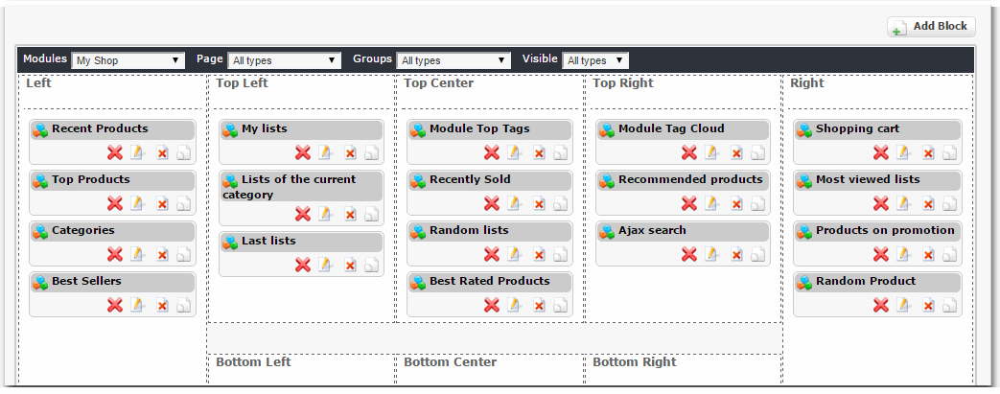

Let's go and view them one by one:

## Recent Products

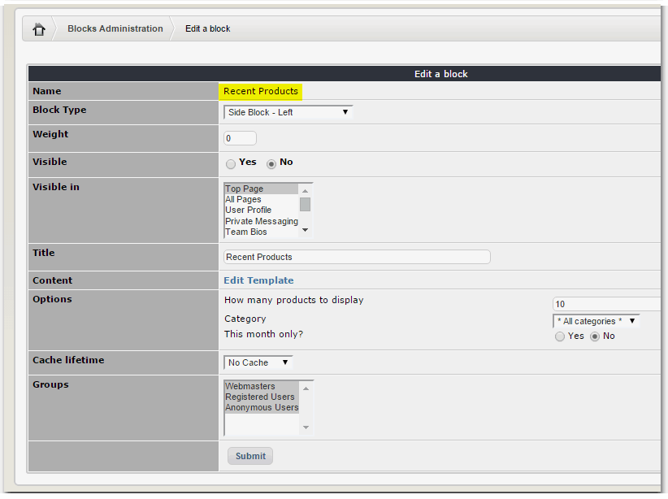

## Top Products

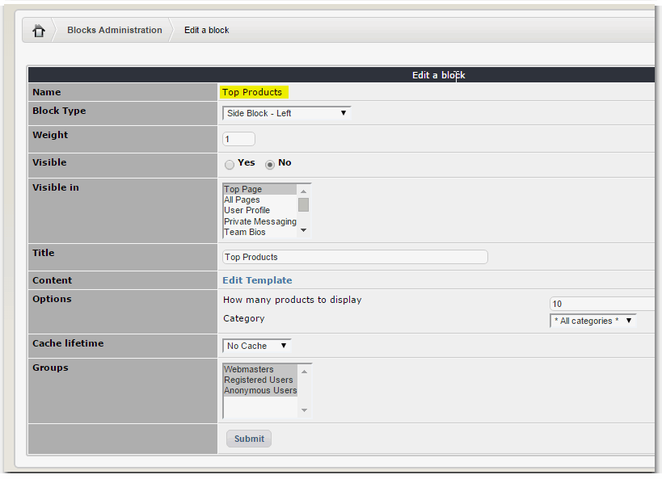

## Categories

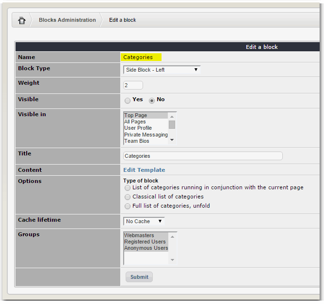

## Best Sellers

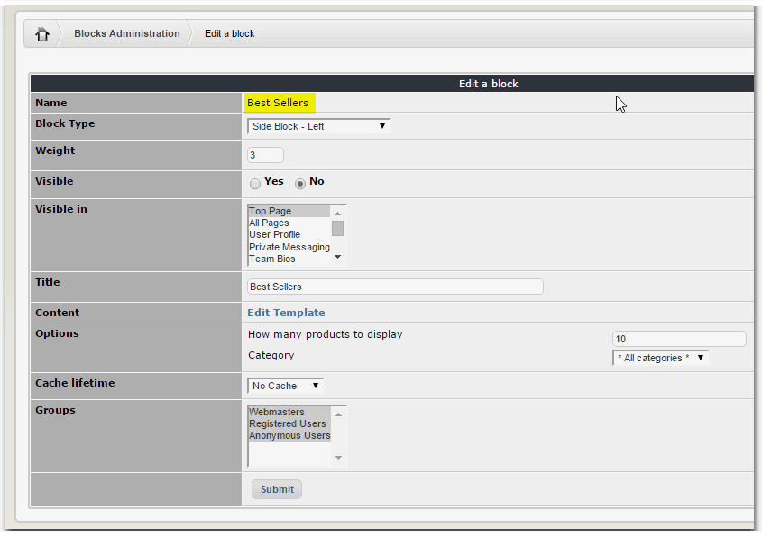

## My Lists

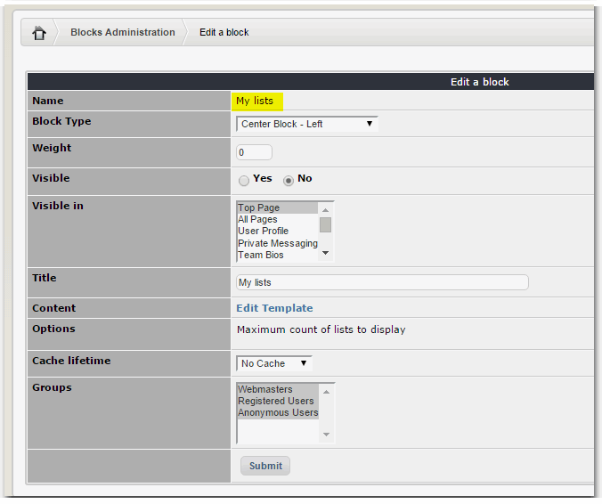

## Lists of current category

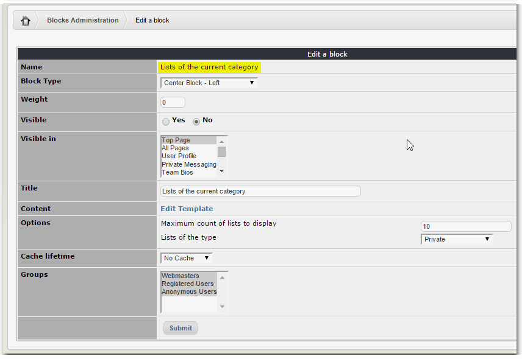

## Module Top Tags

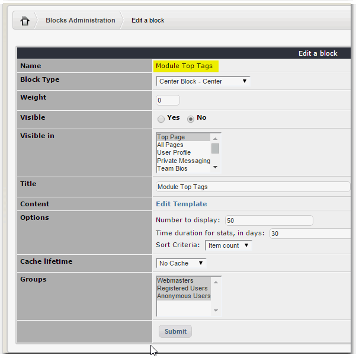

## Recently Sold

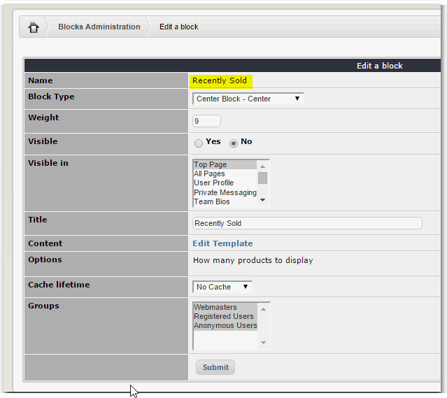

## Random lists

## Best rated products

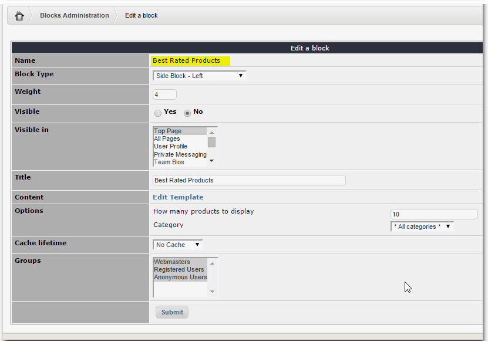

## Module Tag Cloud

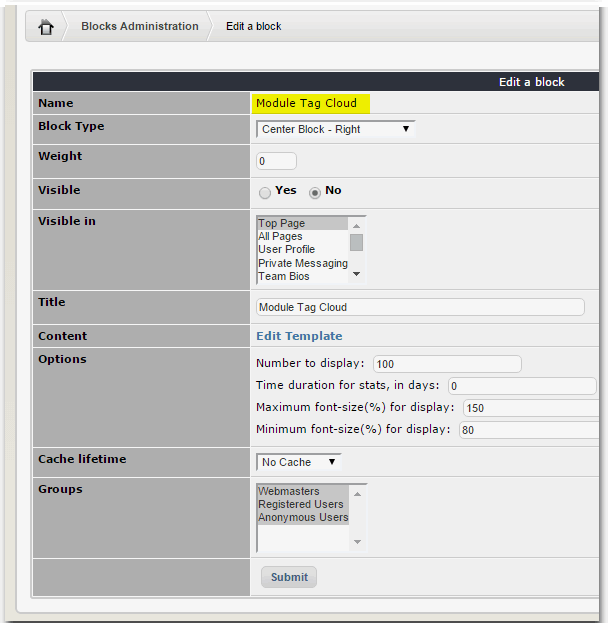

## Recommended products

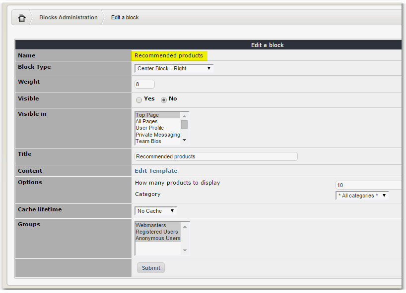

## Ajax search

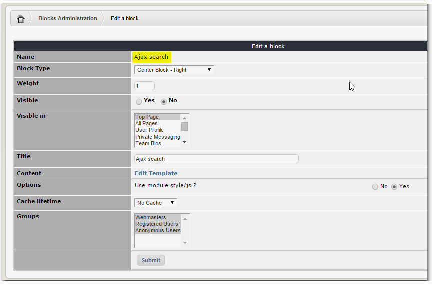

## Shopping Cart

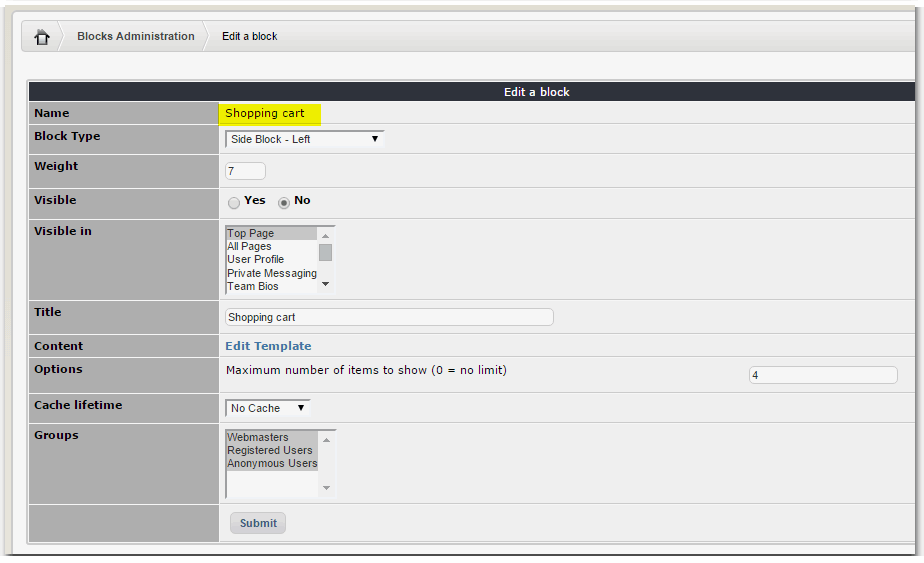

## Most viewed lists

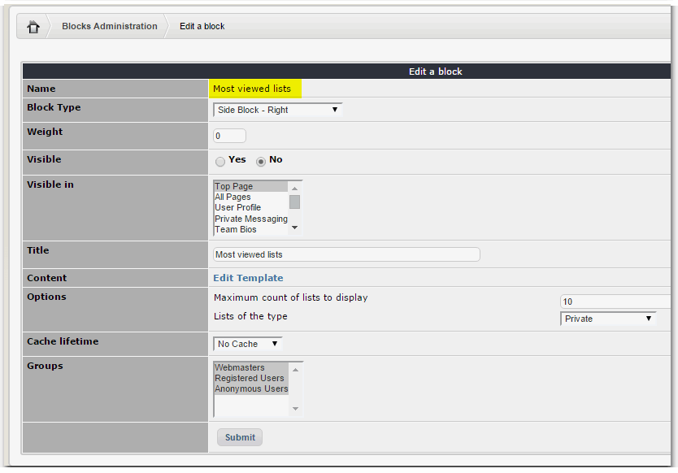

## Products on promotion

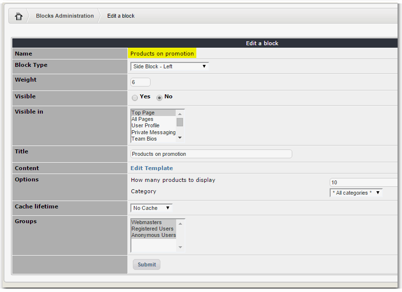

## Random Products

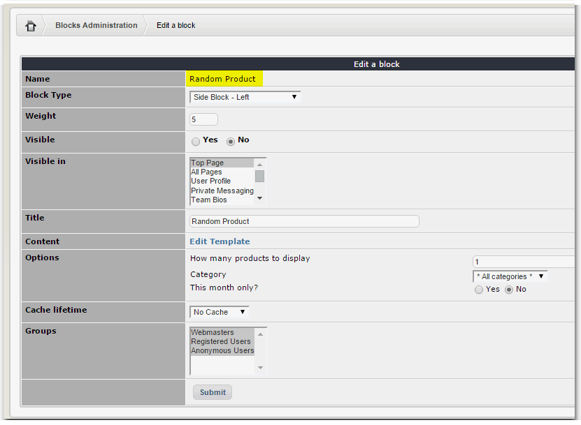

Some of the blocks you can see in action here below:

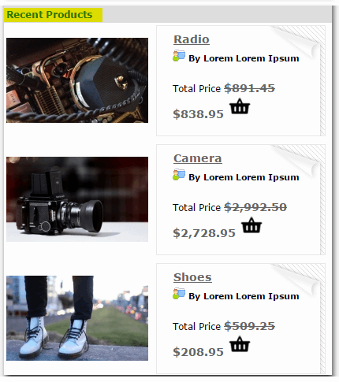

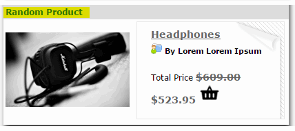

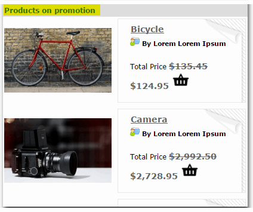

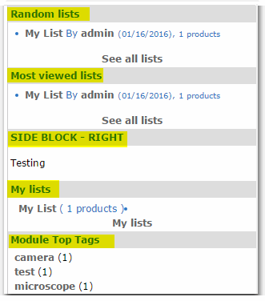

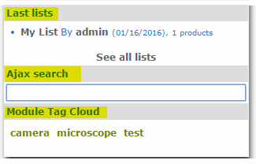

