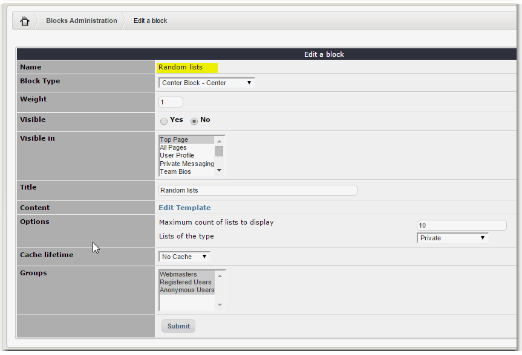

# Blocks

MyShop has several "Blocks" to make it easier for you to run your e-Commerce business:

* Recent Products
* Top Products
* Categories
* Best Sellers
* My Lists
* Lists of current category 
* Module Top Tags
* Recently Sold
* Random lists
* Best rated products
* Module Tag Cloud
* Recommended products
* Ajax search
* Shopping Cart
* Most viewed lists
* Products on promotion
* Random Products

Let's go and view them one by one:

## Recent Products

## Top Products

## Categories

## Best Sellers

## My Lists

## Lists of current category

## Module Top Tags

## Recently Sold

## Random lists

## Best rated products

## Module Tag Cloud

## Recommended products

## Ajax search

## Shopping Cart

## Most viewed lists

## Products on promotion

## Random Products

Some of the blocks you can see in action here below:

