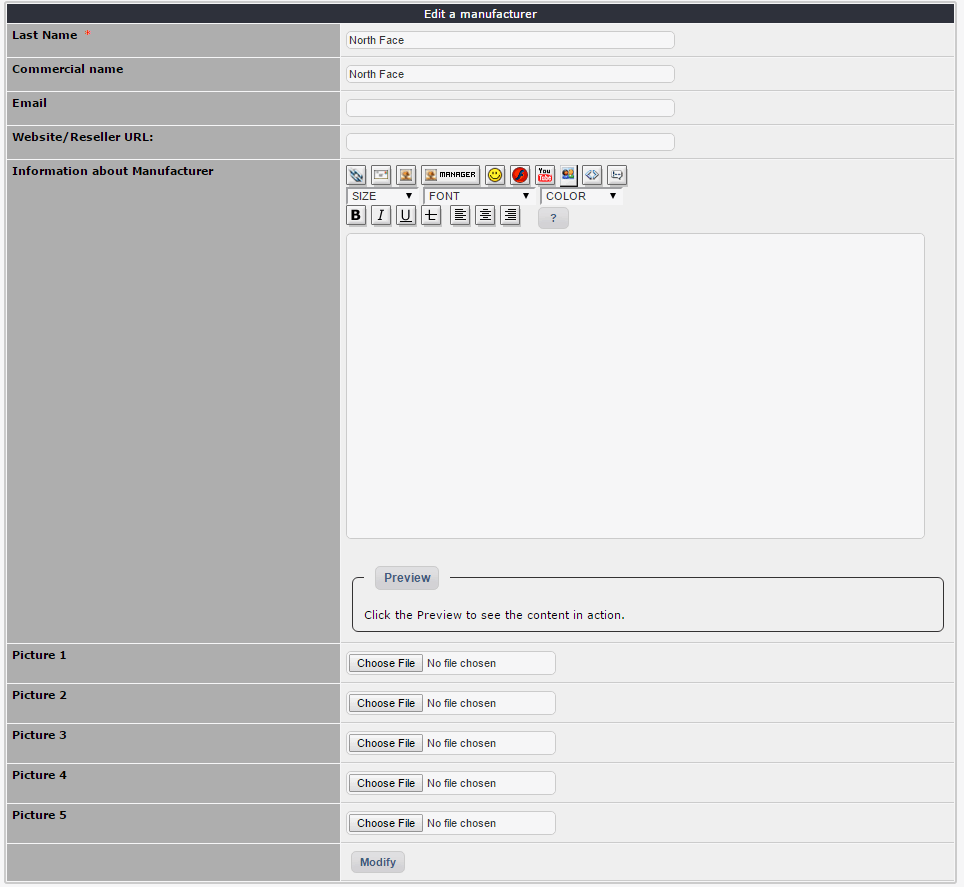
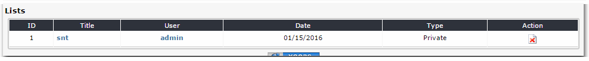

# 2.0 Administration Menu

Oledrion is the best and most comprehensive e-Commerce module, developed natively for XOOPS.

 ### **Vendors manager**

 
### **VAT (Value Added Tax) manager**

 
### **Categories manager**

### **Manufacturers manager**

 
 Advanced products management (with the possibility of linking an unlimited number of files for each product)

 
### **Orders manager**

 
 

### **A very advanced Discounts manager**

 
 
 
### **Newsletter**

 
### **Inventory Control**

 
### **Online and off-line payment**

    

### **Packing**

 
### **Location**

 

### **Delivery**

 

### **Lists**

### **Attachments**

 
### **Use an internal cache to limit MySQL queries**

 
### **RSS**
 
### **Integrated with the XOOPS search (and advanced search)**
 
### **Notifications system for sales**
 
### **Several blocks**
 
### **Integration of the XOOPS comments**

### **URL Rewriting**

### **About info**

