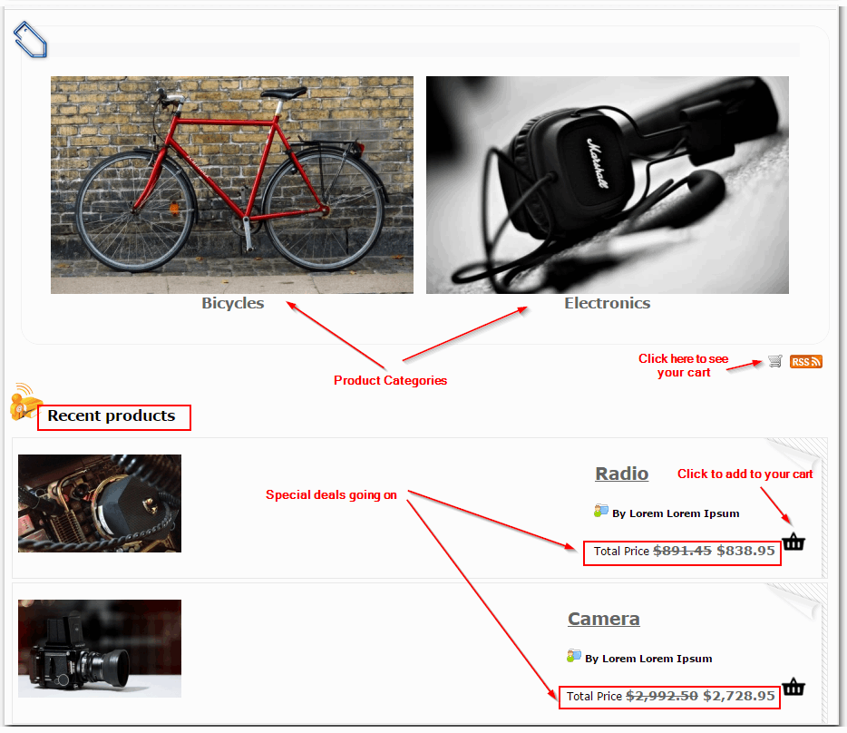
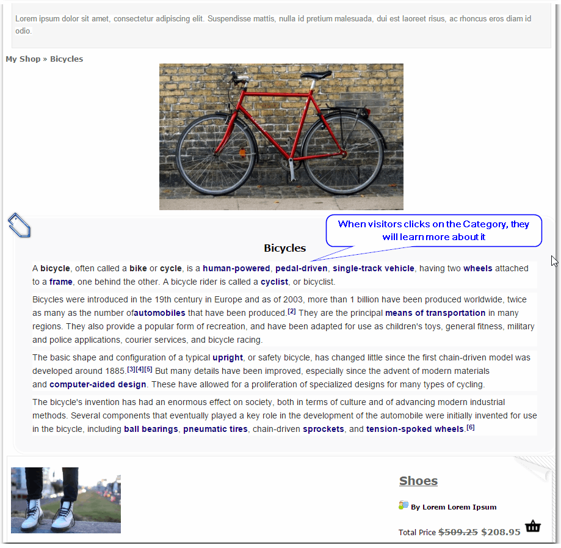
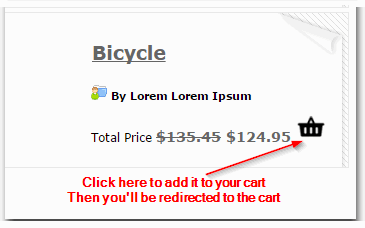
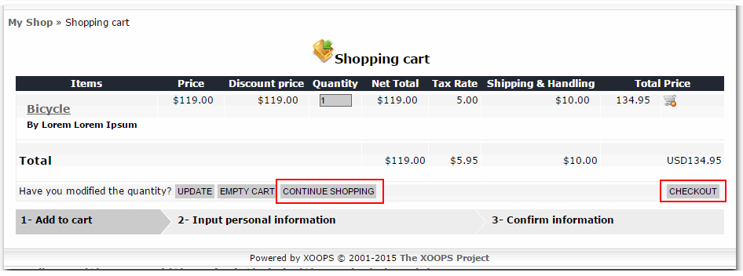
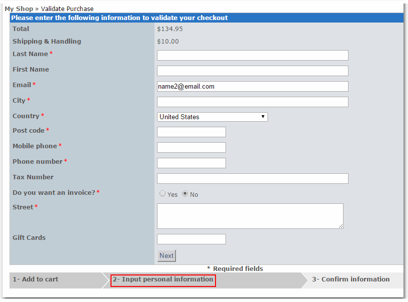
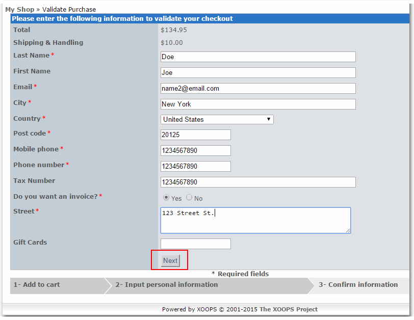
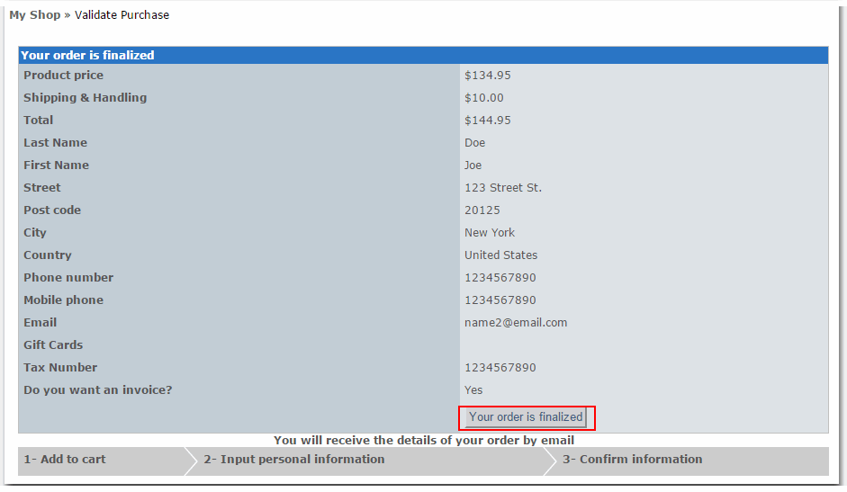
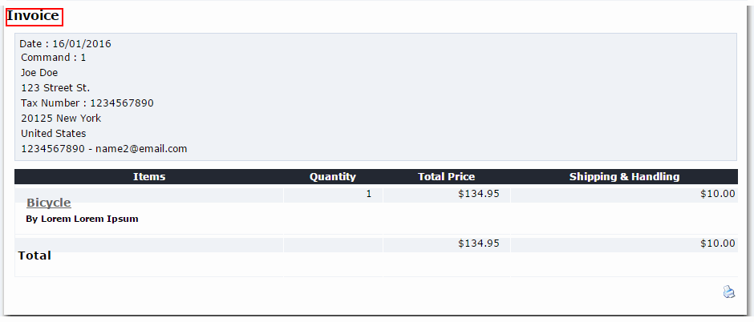
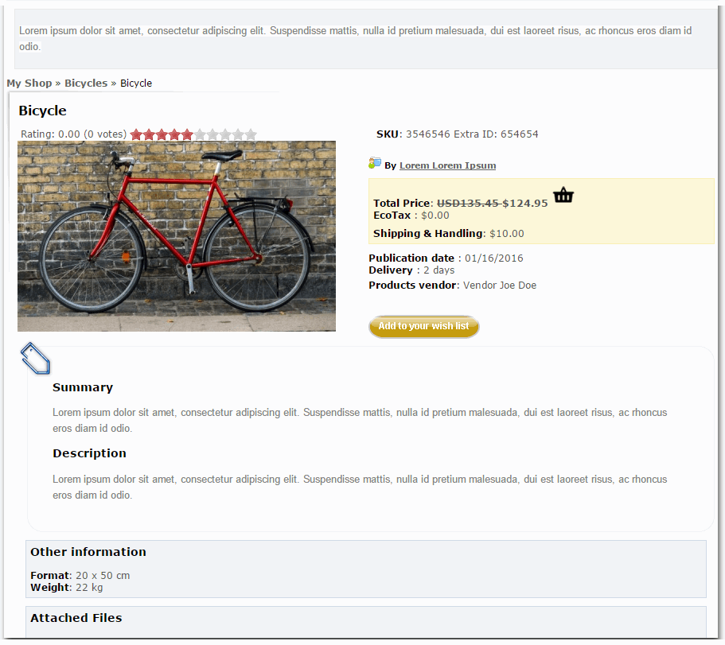
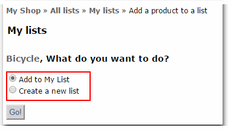

# The User Side

Once the Admin sets the Oledrion e-Commerce shop, the visitors to the Website will see the products that are being offered for sale.

Of course, the Admin can change the layout of the Oledrion page, but in the standard version, visitors will see something like this:

The Oledrion e-Commerce Site can have many categories, with many products, with different discounts.

If the user is interested, he can explore the individual categories and products.

If the user clicks on the black cart, the product will be added to his cart, and he'll be redirected to the cart. There, the user can decide to either continue shopping, or to check out.

In case, he wants to check out, he'll need to provide his personal information to qualify for the purchase.

Once the information is validated, the user will be presented with an invoice.

The user can continue to shop or to look around. He can rate the products, and he can also add them to his "Wish List":

As you can see, the Oledrion experience is very similar to any other e-Commerce site.

